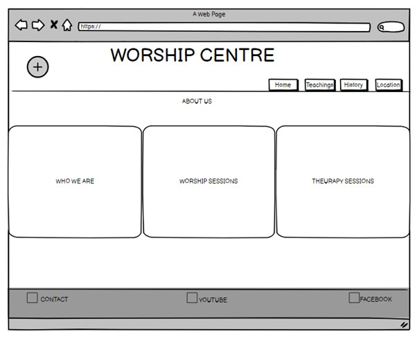

# WORSHIP CENTRE
## 

## Table of Content

- [The Why](#the-why)
- [The Business Goal](#the-business-goal)
- [(UX) User Experience:](#-ux--user-experience-)
  * [User Stories](#user-stories)
    + [First time Users Goals:](#first-time-users-goals-)
    + [Returning Users Goals:](#returning-users-goals-)
    + [Website Owner Goals:](#website-owner-goals-)
- [**THE 5 PLANES**](#--the-5-planes--)

  * [**Strategy**](#--strategy--)
- [Design:](#design-)

  * [Theme and Colour Scheme](#theme-and-colour-scheme)
    + [Colour By colour:](#colour-by-colour-)
  * [Design Brief:](#design-brief-)
- [Wireframes](#wireframes)

- [Features](#features)

    + [Existing Features:](#existing-features-)
      - [Navigation bar:](#navigation-bar-)
      - [Courses display list:](#courses-display-list-)
      - [Course detail:](#course-detail-)

      
      - [Footer.](#footer)

      - [Download the content](#download-the-content)
    
    

- [**TESTING**](#--testing--)
    + [**HTML Testing**](#--html-testing--)
    + [**CSS Testing**](#--css-testing--)

    + [**User Stories Testing**](#--user-stories-testing--)
    + [**Cross Platfrom Testing**](#--cross-platfrom-testing--)
    + [CRUD (create, read, update, delete) TESTING](#crud--create--read--update--delete--testing)

  * [Lighthouse testing](#lighthouse-testing)
  * [Responsive Testing](#responsive-testing)

  * [Bugs and Fixes](#bugs-and-fixes)
  * [Remainding Errors in the Google Developers Tool Console:](#remainding-errors-in-the-google-developers-tool-console-)
- [**DEPLOYMENT**](#--deployment--)
  * [Making a local clone](#making-a-local-clone)
  * [Working with a local clone](#working-with-a-local-clone)
- [**CREDITS**](#--credits--)
  * [References](#references)
  * [Acknowledgement](#acknowledgement)
- [**DISCLAIMER**](#--disclaimer--)

<small><i><a href='http://ecotrust-canada.github.io/markdown-toc/'>Table of contents generated with markdown-toc</a></i></small>

# content 

- ## The Reason Why

This website informs users about different activities that take place in this religious centre called " Worship Centre".
Also, the website provide people with access to spiritual teachings through a blog section and conferences links.

- ## Objectives to achieve

+ Make the Worship centre to be known to a very large number of people
+ Provide people with access to teachings of the worship centre
+ Reach out potential members worldwide
 

- ## (UX) User Experience: 

Users of this website can browse easily through differents features to inform themselves with as many as information made available for them. 

- ### User Stories

  - #### First-time Users Goals:
     - To use the website the easiest way possible.
     - To browse through all links available on the website
     - To know as many as information about the worship-centre activities 
     - To Read about origines of the centre
     - To Read about the founder of the centre
     - To know about the physical location of the worship centre

  - #### Returning Users Goals:
     - To follow regularly Teaching blogs updates.
     - To copy written texts for their own use
     - To check about activities scheddules

  - #### Website Owner Goals:
     - Edit information and update teachings
     - Add and Remove contents links

[top](#content)

- ## **THE 5 PLANES** 
- ### **Strategy** 
- Purpose of the website? To be reach out as many peopple as possible  

- Target audience? People who are looking for a spiritual connection with God through religion teachings. 

- Value to the user? Free accessing to many updated teachings that will support their level of religious believe.

- What makes a good experience? 
    * An easy-navigation, with few clicks be able to find what drives their interest to visit the website. 
    * A non-cluttered appearance to avoid over-irritable stimulation 
    * An easy experience  while the needed information
    * A consistent theme or structure accross devices
    
- What we should not do? 
    * Make it difficult to access most information  
    * Provide inaccurate infromation which do not answer questions of the targeted users 

   - ## Design:

   - ### Theme and Colour Scheme

Variants of Purple, variants of White and blue Color Scheme

List of purples:  #5c0c6c, #a326bc,

List of whites: (#fff), (#f9f9f9),  (#f1f1f1), rgb(255, 255, 255)

- #### Colour By colour: 

The reason of choosing these variants of purple to be predominant for this website theme is because purple symbolises spiritual manifestations as well as conveying religious emotions.  

The white colour being a great contraste to purple, these variants of white are used to provide a good visual balance which makes the website to be attractive.

A negligible quantity of blue is used to emphesise the contraste when a button on the navigation bar is active and also when a link is selected. 

- ### Design Brief:

+ Colour:

- Links : 

+ Background:

[top](#content)

- ## Wireframes

The Basic structure of the website was created by using: 

 [balsamiq](https://balsamiq.com/).

- PC Mac screen: 

 

 

 

 

 

 

 

 
 

[top](#content)

## Existing Features:

- __Title__

- __Logo__ 

- __Navigation bar__

    - Home 
    - Teachings
    - History
    - Locations

    

- __Home page (About us)__
   
   - Who we are ?
   - Worship sessions
   - Theurapy sessions

- __Teachings page (Our teachings)__

   - Conferences
   - Blog

- __History page (The history of the centre)__

   - Founder history
   - Centre history

- __Locations (Where are we located)__

   - Bzville
   - Mayaville
   - Pnrville
   - Dolcity

- __Footer__

   - Contact link
   - Youtube link
   - Facebook link

   
## Features left to be added

  - Membership Suscription page
  - Donation button
  - Advertisement window

